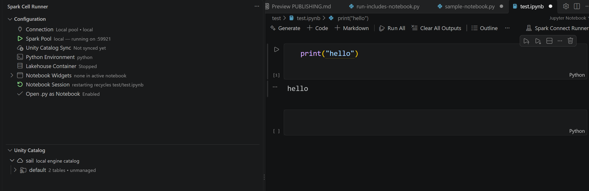
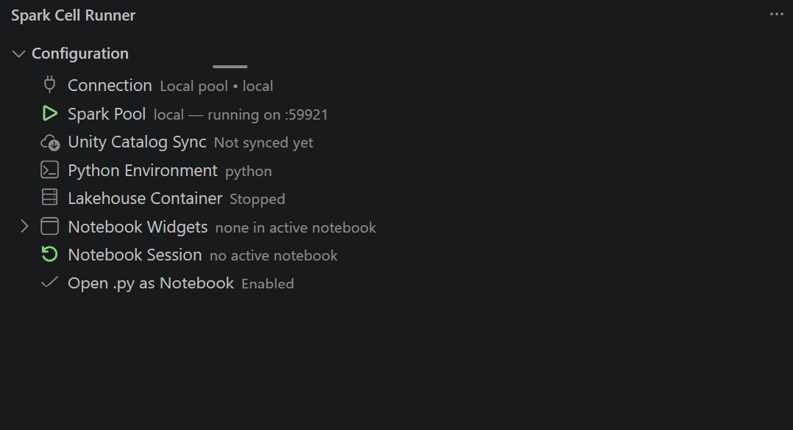
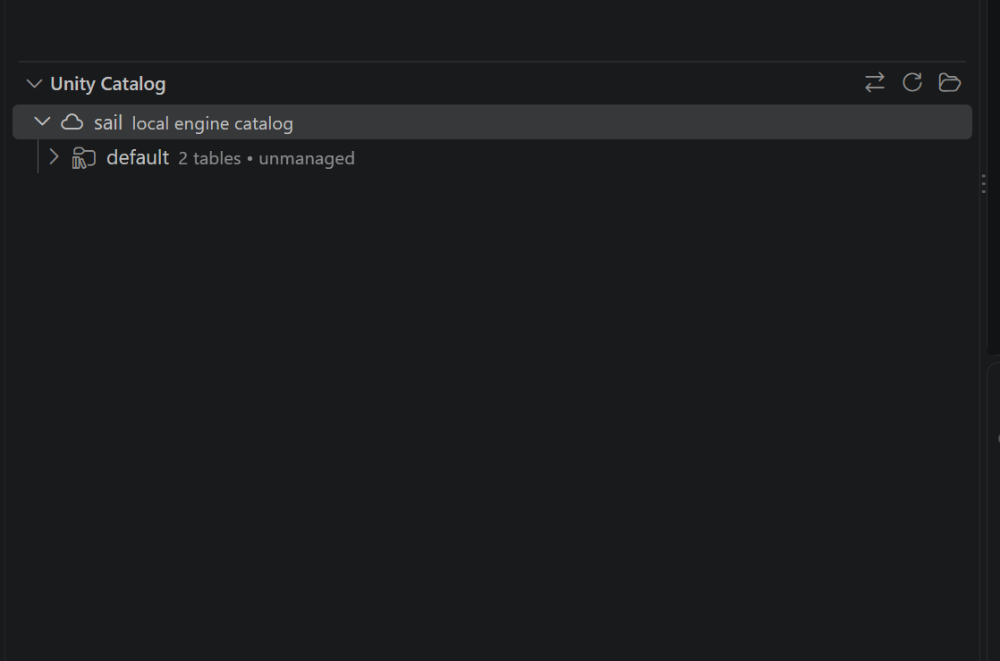

<div align="center">


# Spark Cell Runner

**Run Databricks notebook-source files and SQL in VS Code — on Databricks, or fully offline on a local Spark pool.**

*An open source VS Code extension for Databricks engineers who want notebook-grade development — even when the serverless endpoint is unreachable.*

[](package.json)
[](LICENSE)
[](https://code.visualstudio.com)
[](https://github.com/lakehq/sail)



**Try it now — build and install in under a minute:**

```bash
git clone https://github.com/Iamprashanth-1/spark-cell-runner.git
cd spark-cell-runner && npm install -g @vscode/vsce
npx vsce package && code --install-extension spark-cell-runner-0.6.5.vsix
```

</div>

---

## Table of Contents

- [Why](#why)
- [Features](#features)
- [Quick Start](#quick-start)
- [Architecture](#architecture)
  - [Run Pipeline](#run-pipeline)
  - [Local Spark Pools](#local-spark-pools)
  - [Why Sail?](#why-sail)
  - [Unity Catalog Explorer](#unity-catalog-explorer)
  - [Unity Catalog Sync](#unity-catalog-sync)
  - [SQL Execution](#sql-execution)
  - [Lakehouse Container](#lakehouse-container)
  - [Data and State on Disk](#data-and-state-on-disk)
- [Configuration](#configuration)
- [Commands](#commands)
- [Examples](#examples)
- [Project Layout](#project-layout)
- [Build and Install](#build-and-install)
- [Development and Testing](#development-and-testing)
- [Publishing to the Marketplace](#publishing-to-the-marketplace)
- [Troubleshooting](#troubleshooting)
- [Contributing](#contributing)
- [License](#license)

## Why

Databricks notebook development usually means one of two things: a browser you
keep switching to, or `databricks-connect` that fails the moment a serverless
endpoint is unreachable or you're on a train.

**Spark Cell Runner** gives you a third option — a local, Jupyter-like
experience inside VS Code with two interchangeable backends:

| | **Databricks mode** | **Local pool mode** |
| --- | --- | --- |
| Engine | Databricks serverless / cluster via `databricks-connect` | [Sail](https://github.com/lakehq/sail) Spark Connect server on `localhost` |
| Network | Cloud required | **Fully offline** |
| Compute | Real Databricks compute | Single Rust process, ~1 s startup |
| Tables | Real Unity Catalog | Local Delta warehouse on disk |

Same notebook code, same compatibility shim, either backend.

**How is this different from the official Databricks extension?** The official
one connects you to a live Databricks workspace and runs cells on cloud
compute — the right tool for real jobs. Spark Cell Runner speaks the same
notebook-source format and shims the same `dbutils` APIs, but can run with
**zero cloud dependencies** on a local Sail pool, sync a slice of Unity
Catalog down for offline work, and execute ad-hoc SQL against a local Delta
warehouse. They coexist happily — use both.

## Quick Start

**1. Create and start a local pool** (Configuration panel → Spark Pool → *Create new pool*):

```
[pool] "local" is serving on sc://127.0.0.1:59921
```

**2. Open [`examples/01_hello_spark.py`](examples/01_hello_spark.py) and run a cell** — output appears on the cell and in the results panel:

```
Spark version: 4.2.0
+---+-------+
| id|squared|
+---+-------+
|  1|    1.0|
+---+-------+
```

**3. Open a `.sql` file and press Ctrl+Enter** — results stream into the output channel:

```
[sql] run selection - 1 statement(s) executed, 0 failed
[sql]    3 rows
[sql]    id,label
[sql]    1,row-1
```

That's the whole loop: explore tables in the Unity Catalog panel → click
**Query** → edit → Ctrl+Enter → read results in the output channel.

## Features

- **Cell-level execution** of Databricks notebook-source `.py` files (and
  `.ipynb`): run current cell, all cells, run-to-cursor, with per-cell
  decorations, CodeLenses, and a results panel.
- **Two connection modes** — Databricks (serverless/cluster) or a local Spark
  pool that needs no cloud access at all.
- **Databricks compatibility shim** — `%sql` / `%sh` / `%pip` / `%fs` / `%md`
  magics, `%run` expansion, `dbutils` proxies (widgets, secrets, fs, notebook,
  library), `/Workspace/` and `/Volumes/` path translation.
- **Local Spark pools** — named Sail servers with manifests, logs, lifecycle
  control, and isolated warehouses, managed entirely from the sidebar.
- **Unity Catalog explorer** — browse catalogs/schemas/tables/columns from
  Databricks (REST) or the local warehouse (disk), with table previews.
- **Unity Catalog sync** — mirror dev schemas/tables into the local warehouse
  (schema-only, or schema + data with a row limit).
- **SQL execution** — run `.sql` files, selections, or statements on the pool
  (Ctrl+Enter), with results in the output channel.
- **Lakehouse container** — expose the warehouse to Docker/Podman Desktop as a
  browsable UI.
- **SQL-aware environment picker** — validates the interpreter for the active
  mode (pysail + pyspark locally, databricks-connect in the cloud).

## Architecture

```text
                          VS Code (this extension)
  ┌────────────────────────────────────────────────────────────────┐
  │  notebook editor / .py source   Configuration tree   commands   │
  │        │                              │                │       │
  │        ▼                              ▼                │       │
  │   scriptBuilder ──► session (JSON over stdio) ◄──── ──┘       │
  │                          │                                    │
  │                     session_driver.py (persistent python proc) │
  │                          │   bootstrap.py + runtime_data.py    │
  └──────────────────────────┼─────────────────────────────────────┘
                             │
        ┌────────────────────┴─────────────────────┐
        ▼ databricks-connect                       ▼ Spark Connect (sc://127.0.0.1:<port>)
  Databricks serverless / cluster          Local Sail pool (lakehq/sail, Rust engine)
  (cloud, Unity Catalog)                   (offline, Delta warehouse on local disk)
                                                   │
                                     ┌─────────────┴──────────────┐
                                     ▼                            ▼
                              ~/.spark-cell-runner/warehouse   Docker/Podman
                              (local Delta tables)             stack (FileBrowser UI)
```

### Run Pipeline

1. **Parsing** (`parser.js`) — notebook-source `.py` files are split into
   cells on `# COMMAND ----------` separators; `# MAGIC` lines are decoded
   into magics (`%sql`, `%pip`, ...).
2. **Script building** (`scriptBuilder.js`) — each run compiles a flat
   Python script: prior-cell context (or replay of executed cells),
   translated magics, and expanded `%run` includes (parsed recursively and
   cached).
3. **Session** (`session.js` + `src/python/session_driver.py`) — one
   long-lived Python process per notebook, speaking a JSON-line protocol over
   stdio (`{"type":"exec","id","code"}` → `{"type":"result","id","ok",...}`).
   State persists across cells, Jupyter-style. The session is keyed by
   notebook URI and a **config signature** (interpreter, profile, cluster,
   connection mode, pool) — changing any of those transparently recycles the
   process. In local mode the session runs in the pool's environment, so the
   interpreter may differ from the general `pythonCommand` setting.
4. **Bootstrap** (`src/python/bootstrap.py`, assembled by `pyResources.js`) —
   executed inside the session on first use. It creates `spark`/`sql` (either
   `DatabricksSession.builder...` or
   `SparkSession.builder.remote("sc://127.0.0.1:<port>")` depending on
   `connectionMode`), installs the `dbutils` proxies, and monkeypatches
   `builtins.open` / `os.path` so Databricks-style paths resolve to mapped
   local folders (see `workspacePathMappings`).
5. **Results** (`runner.js`, `ui/decorations.js`, `ui/resultPanel.js`) —
   output is captured per cell into decorations and a results webview; the
   generated script and result text are written under `tempFolder`.

The session wire protocol (JSON lines over stdio) is deliberately tiny:

```text
--> {"type": "exec", "id": 3, "code": "<base64 python>"}
<-- {"type": "ready"}                                  (once, at startup)
<-- {"type": "result", "id": 3, "ok": true,
     "stdout": "...", "stderr": "..."}
```

Because both sides of the connection live in the selected Python environment,
the protocol is the only coupling point — swapping the engine or the
connection mode never changes it.

### Local Spark Pools

A pool is a detached Sail Spark Connect server
(`python -m pysail spark server --ip 127.0.0.1 --port <port>`) plus a JSON
manifest in `~/.spark-cell-runner/pools/<name>.json`:

```json
{
  "name": "local",
  "engine": "sail",
  "pythonCommand": "C:\\...\\.venv\\Scripts\\python.exe",
  "port": 51234,
  "warehousePath": "C:\\Users\\<you>\\.spark-cell-runner\\warehouse\\local",
  "pid": 12345,
  "logFile": "...\\pools\\logs\\local.log"
}
```

- Manifests live in the user home, so pools are shared across workspaces and
  survive VS Code restarts; the server process is detached from the
  extension host.
- `poolManager.js` handles creation (name validation, free-port selection,
  warehouse creation), start (health-checked by probing the Spark Connect
  port), stop (PID kill, `taskkill /T /F` on Windows), and per-pool logs.
- The server's working directory is pinned to its warehouse, so managed
  tables land inside the pool's own folder.
- In local mode, notebook sessions deliberately run in the **pool's own
  Python environment** — that's where the matching `pyspark` client lives.
- A **warehouse registry** (`src/python/warehouse_registry.py`) re-registers
  on-disk Delta tables into every session, so `sail.<schema>.<table>` named
  queries resolve even though Sail's metastore is session-scoped.

<p align="center"></p>

### Why Sail?

The local pool runs **[Sail](https://github.com/lakehq/sail)** (PyPI package
`pysail`) as the Spark engine:

- **No JVM, no cluster** — Sail is a single Rust process installed with
  `pip install pysail`; a pool starts serving Spark Connect in about a second.
- **Spark Connect protocol** — notebook sessions are ordinary PySpark clients
  (`SparkSession.builder.remote(...)`), the same protocol Databricks uses, so
  cell code stays engine-agnostic.
- **Delta tables on local disk** — Sail writes Delta-format tables into the
  pool's warehouse directory; that's what the explorer reads and what the
  lakehouse container browses.
- **Swappable by design** — the pool manifest records `engine`, and the
  bootstrap only needs a Spark Connect endpoint, so a future pool can point
  at any Spark-Connect-compatible engine without touching notebook code.

> **Known limitation:** Sail's metastore is session-scoped. `CREATE SCHEMA`
> / `saveAsTable` names are lost when the pool restarts — but the Delta files
> are durable, and the warehouse registry + explorer + sync all read from
> disk. For stable names, write to explicit paths
> (`df.write.format('delta').save('hello.db/mytable')`).

### Unity Catalog Explorer

A lazy tree view browsing catalogs/schemas/tables/columns from one of two
sources (switch with the swap button in the view title):

- **Databricks** — real Unity Catalog over the REST SDK (no compute needed).
  Right-click a table → *Sync This Table* to pull just that table locally.
- **Local warehouse** — reads the pool's Delta files **directly from disk**,
  so it always shows what actually exists, even when the pool is stopped.
- **Auto** (default) — local when the pool is running, Databricks otherwise.

<p align="center"></p>

### Unity Catalog Sync

`ucSync.js` spawns `src/python/uc_sync.py` as a one-shot process (deliberately
separate from notebook sessions). It reads metadata over REST with the
Databricks SDK and writes to the pool over Spark Connect, streaming JSON
progress lines back to the extension.

- **schema mode** — recreates catalogs/schemas and *empty* Delta tables with
  identical columns/types. No cluster needed.
- **data mode** — additionally copies rows through a Databricks session
  (honoring `useServerless`/`clusterId`), with an optional row limit.
- Filters (catalog, schema, table glob, mode, limit) are workspace settings,
  so syncs are reproducible per project.

### SQL Execution

- `.sql` files get **CodeLenses** ("Run on pool" per statement, "Run file" at
  the top) and **Ctrl+Enter / Shift+Enter** keybindings.
- Select a statement → runs the selection; cursor in a statement → runs that
  statement; results stream into the Spark Cell Runner output channel as CSV.
- A failing statement stops the run and reports its real error.
- Local tables are addressable by name (`sail.<schema>.<table>`) thanks to
  the warehouse registry, with `delta.\`<path>\`` as the path-based fallback.

### Lakehouse Container

`containerManager.js` detects Docker, then Podman, and generates a Compose
project `spark-cell-runner-<pool>` that bind-mounts the pool warehouse into
`filebrowser/filebrowser`. Compute stays native via the pool; no JVM images
are pulled. When the stack runs:

| | |
| --- | --- |
| **Warehouse UI URL** | `http://localhost:<port>` (picked automatically, shown in the launch notification) |
| **Username** | `admin` |
| **Password** | Auto-generated on first launch — stored in `<warehouse>/<pool>/.filebrowser-credentials.txt` and re-applied on every launch |

> Recent FileBrowser releases generate a random admin password on first boot
> and require 12+ character passwords, so the extension owns the credentials
> instead of relying on defaults. The stack listens on localhost only.

### Data and State on Disk

```text
~/.spark-cell-runner/
  pools/
    <name>.json          Pool manifests (engine, env, port, warehouse, pid)
    logs/<name>.log      Sail server stdout/stderr per pool
  warehouse/
    <pool>/              Local Delta warehouse of that pool
      docker-compose.yml Generated lakehouse container stack
      .filebrowser.db    FileBrowser login database (container stack)
      .filebrowser-credentials.txt
                         Generated UI login, re-applied on every launch
      <schema>.db/...    Schemas and Delta tables written by notebooks
```

Generated scripts and result text per workspace go to
`<workspace>/sparkCellRunner.tempFolder` (default `.spark-cell-runner/`).

## Configuration

| Setting | Default | Description |
| --- | --- | --- |
| `pythonCommand` | `python` | Interpreter (path or command) used for sessions, pools, and sync. |
| `tempFolder` | `.spark-cell-runner` | Workspace folder for generated scripts and results. |
| `injectDatabricksBootstrap` | `true` | Inject the bootstrap that creates `spark`/`sql`/`dbutils`. |
| `databricksProfile` | *(empty)* | `~/.databrickscfg` profile for Databricks auth. |
| `clusterId` | *(empty)* | Cluster ID for databricks-connect runs. |
| `useServerless` | `false` | Use serverless instead of `clusterId`. |
| `connectionMode` | `databricks` | `databricks` or `local` (Sail pool). |
| `localPool` | *(empty)* | Name of the active local pool. |
| `ucExplorerSource` | `auto` | Unity Catalog explorer source: `auto`, `local`, or `databricks`. |
| `workspacePathMappings` | `{}` | Map `/Workspace/...`-style paths to local folders. |
| `secretValues` | `{}` | Local replacements for `dbutils.secrets.get`, keyed `scope/key`. |
| `widgetValues` | `{}` | Values for `dbutils.widgets`, editable in the sidebar. |
| `openPyFilesAsNotebook` | `false` | Open `.py` files directly in the notebook view. |
| `syncCatalog` / `syncSchema` / `syncTables` | *(empty)* | UC sync filters (empty = all). |
| `syncMode` | `schema` | `schema` or `data`. |
| `syncRowLimit` | `0` | Max rows per table in data mode (0 = unlimited). |

## Commands

All commands live under the **Spark Cell Runner** category:

| Command | Purpose |
| --- | --- |
| `Open as Databricks Notebook` | Open a `.py` source file in the notebook view. |
| `Run Current Cell` / `Run All Cells` / `Run Notebook to Current Cell` | Cell execution. |
| `Preview Current Cell Script` | Inspect the generated flat script. |
| `Show Cell Output` | Reopen the results panel for a cell. |
| `Restart Notebook Session` | Recycle the persistent Python process. |
| `Select Python Environment` / `Set Python Path` / `Use Active VS Code Interpreter` | Interpreter management. |
| `Set Connection Mode` / `Set Cluster ID` / `Toggle Serverless Mode` / `Set Databricks Profile` | Connection targets. |
| `Create / Start / Stop / Delete Local Spark Pool`, `Show Pool Logs`, `Manage Local Spark Pool` | Pool lifecycle. |
| `Install Local Pool Packages` | Install `pysail` + `pyspark-client` into a venv you pick. |
| `Run SQL File on Pool` / `Run Selected SQL on Pool` / `Run Statement on Pool` | SQL execution (also Ctrl+Enter in `.sql` files). |
| `Sync Unity Catalog to Local Pool` | Schema/data sync from dev UC. |
| `Launch / Stop Lakehouse Container`, `Open Warehouse UI` | Docker/Podman stack. |
| `Query Table` / `Preview Data` / `Copy Name` | Unity Catalog explorer actions. |

## Examples

Runnable sample notebooks live in [`examples/`](examples/README.md):

| Example | Demonstrates |
| --- | --- |
| [`01_hello_spark.py`](examples/01_hello_spark.py) | First Spark session, DataFrames, SQL (both modes) |
| [`02_local_delta_warehouse.py`](examples/02_local_delta_warehouse.py) | Schemas and Delta tables in the local warehouse |
| [`03_dbutils_and_widgets.py`](examples/03_dbutils_and_widgets.py) | Widgets, `dbutils.fs`, `display()`, secrets shim |
| [`04_uc_sync_query.py`](examples/04_uc_sync_query.py) | Querying tables synced from Unity Catalog, offline |
| [`05_notebook_with_run.py`](examples/05_notebook_with_run.py) | `%run` includes with shared functions |
| [`test.sql`](examples/test.sql) | SQL execution on the pool |

Open any of them with *Spark Cell Runner: Open as Databricks Notebook* and
run cell-by-cell.

## Project Layout

```
src/
  extension.js        Entry point: activate()/deactivate() wiring only
  constants.js        Shared constants and magic-line regexes
  state.js            Shared mutable singletons (sessions, caches, sync result)
  config.js           sparkCellRunner configuration access + helpers
  commands.js         All vscode.commands registrations
  parser.js           Notebook-source parsing, cell splitting, magic handling
  serializer.js       Notebook <-> "# Databricks notebook source" .py serialization
  codelens.js         Run / preview CodeLenses in the text editor view
  navigation.js       Go to Definition / Find References remapping for cells
  scriptBuilder.js    Generated-script construction, %run expansion, magic translation
  session.js          Persistent per-notebook python sessions (JSON stdio protocol)
  runner.js           Run orchestration + notebook controllers
  pythonEnv.js        Interpreter discovery, Databricks Connect validation, child env
  poolManager.js      Local Spark pool manifests + Sail server lifecycle
  sqlRunner.js        SQL execution on the pool + result rendering
  ucSync.js           Unity Catalog -> local pool sync orchestration
  containerManager.js Docker/Podman compose stack (FileBrowser over the warehouse)
  pyResources.js      Loads the Python templates and injects settings
  python/
    bootstrap.py        Session bootstrap: spark/sql, dbutils proxies, path translation
    runtime_data.py     Per-run widget/secret/path-mapping values (template)
    session_driver.py   Long-lived python process executing code blocks over stdio
    uc_sync.py          One-shot UC -> pool sync driver (JSON progress on stdout)
    uc_explore.py       Catalog/schema/table listing for the explorer (REST or Spark)
    execute_sql.py      Multi-statement SQL driver for the local pool
    preview_table.py    Path-based Delta table preview driver
    warehouse_registry.py Re-registers on-disk Delta tables into each session
  ui/
    configurationTree.js Configuration panel (native tree, Databricks-style)
    unityCatalogTree.js  Unity Catalog / warehouse explorer tree
    sqlCodeLens.js       Run-on-pool CodeLenses for .sql files
    statusBar.js         Status bar item (interpreter / profile / cluster)
    decorations.js       Per-cell run state decorations + run-state store
    resultPanel.js       Results webview (summary / stdout / stderr / script)
examples/             Runnable sample notebooks (see examples/README.md)
test/                 Sample notebooks, UI previews (npm run preview:ui)
```

## Build and Install

Requires Node.js and the [vsce](https://github.com/microsoft/vscode-vsce) CLI:

```bash
npm install -g @vscode/vsce
npm run package        # produces spark-cell-runner-0.6.5.vsix
```

Install (uninstall older versions first so cached assets refresh):

```bash
code --uninstall-extension PrashanthReddyMunagala.spark-cell-runner
code --install-extension spark-cell-runner-0.6.5.vsix
```

Then fully quit and restart VS Code. To uninstall:
`code --uninstall-extension PrashanthReddyMunagala.spark-cell-runner`.

> No build/compile step is needed — the extension is plain CommonJS JavaScript
> plus Python resources in `src/python/`, which `vsce` packages as-is.

## Development and Testing

- `npm run preview:ui` renders the configuration tree outline and results
  panel to `test/preview/` — iterate on UI with no extension reload.
- **F5** launches an Extension Development Host on the `test/` workspace with
  sample notebooks (widgets, `%sql`, `%run`).
- JS changes need an extension-host reload; `src/python/*.py` template
  changes are picked up on the next run.
- Python resources must stay compatible with **Python 3.10+** — check with
  `py -3.10 -m py_compile src/python/*.py`.
- See [PUBLISHING.md](PUBLISHING.md) for the Marketplace release flow.

## Publishing to the Marketplace

One-time setup (publisher, PAT) and the per-release flow are documented in
[PUBLISHING.md](PUBLISHING.md). In short:

```bash
npx vsce login PrashanthReddyMunagala   # paste your Marketplace PAT once
npx vsce publish patch                  # bumps the version, packages, publishes
```

## Troubleshooting

| Symptom | Cause / fix |
| --- | --- |
| `SyntaxError: f-string: unmatched '('` at bootstrap | Runner environment older than Python 3.12 with a bootstrap regression — fixed since 0.3.0. |
| `NameError: dcr_original_isfile` at bootstrap | Fixed since 0.3.0 (definition used before assignment). |
| `Local Spark pool bootstrap failed: No module named 'pyspark'` | Notebook sessions run in the pool's venv in local mode — start the pool via the sidebar; its env carries pyspark. |
| `No Delta tables found in <path>` (explorer) | Fixed since 0.5.5 (missing `fs` import). Also check the `[uc-explorer]` diagnostics line in the output channel. |
| `quay.io ... 401 Unauthorized` when launching the lakehouse stack | Old extension version using MinIO images; update — the stack now uses `filebrowser/filebrowser`. |
| Named queries say `Database not found` after a pool restart | Expected on old versions — since 0.6.3 the warehouse registry re-registers on-disk tables into every session. |
| SQL runs but results are missing | Check the Spark Cell Runner output channel — results render there since 0.6.2. |
| Sync fails with SDK/auth errors | Verify `databricksProfile` works (`databricks auth login`) and the pool is running. |
| The "open .py as notebook" toggle doesn't change how files open | It writes `workbench.editorAssociations` (workspace, falling back to user scope). Remove any User-level `*.py` association and fully restart. |

## Contributing

Issues and PRs are welcome. Keep in mind:

- Plain CommonJS JavaScript — no build/compile step.
- Python resources must stay **Python 3.10+ compatible** (no 3.12-only f-string
  syntax); run `py -3.10 -m py_compile src/python/*.py` before submitting.
- Generated scripts and templates are validated as real Python — keep it that
  way in PRs.
- Bump the version in `package.json` (and the sidebar footer version string)
  for every user-visible change.

## License

[MIT](LICENSE)
